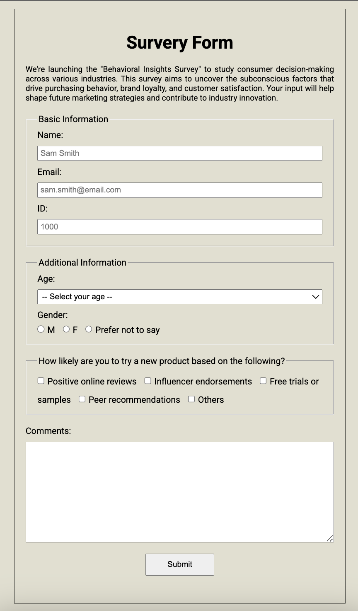
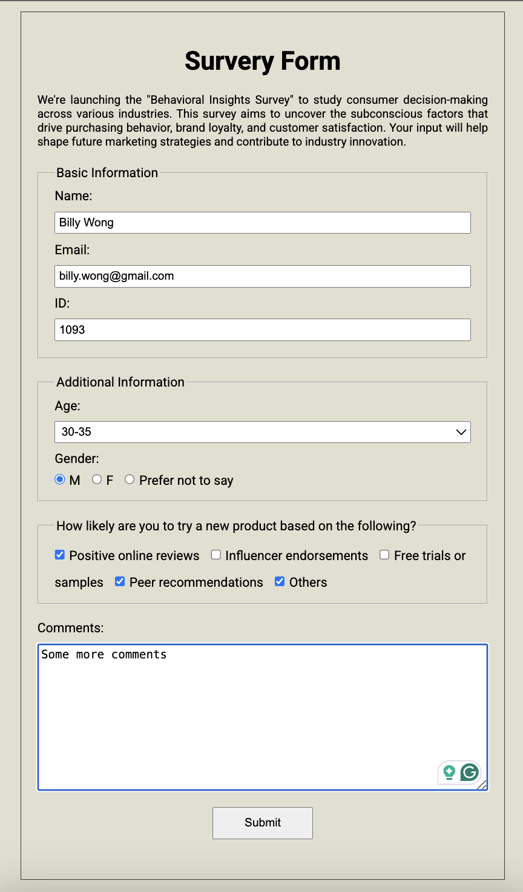

# Survey Form Project

## Overview
This project is a simple survey form built using basic HTML and CSS. The main objective of this project is to experiment with various HTML tags and test their functionalities in a practical form-based layout.

  

## Features
- Uses a wide range of HTML tags including `<input>`, `<select>`, `<textarea>`, `<fieldset>`, `<legend>`, `<label>`, and more.
- Styled with basic CSS to improve layout and readability.
- Includes various form elements like text fields, checkboxes, radio buttons, dropdowns, and a submit button.

## Technologies Used
- HTML: For structuring the survey form.
- CSS: For styling the form elements.

## How to Use
1. Clone this repository: git clone https://github.com/your-username/survey-form.git
2. Open the index.html file in any web browser.

## Future Improvements
- [ ] Add JavaScript validation for form inputs.
- [ ] Improve the CSS for better design and responsiveness.
- [ ] Enhance user experience with animations and interactivity.
